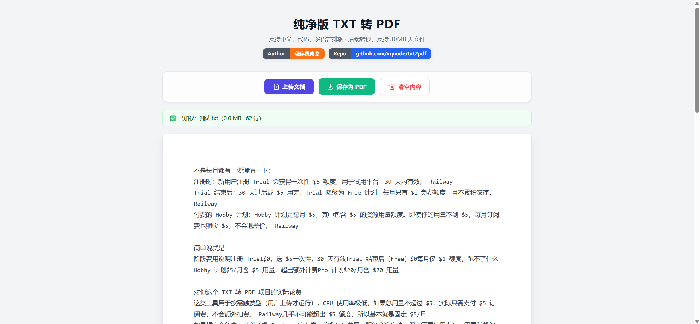

# txt2pdf

[中文](./README.md) | [English](./README.en.md)


An online `TXT -> PDF` tool built for Chinese text, source code, and large plain-text files.

It supports Chinese rendering, code-friendly layout, chunked conversion for large files, and browser-side PDF merging to avoid common Serverless payload limits.

Live demo:

- https://txt2pdf.vercel.app/

Repository:

- https://github.com/xqnode/txt2pdf

Author:

- 程序员青戈

## Why this project

Many online `txt to pdf` tools fail in real-world scenarios such as:

- broken Chinese text rendering
- large TXT files failing to process
- poor formatting for code and mixed text
- Serverless deployments breaking on large merge requests

This project is built to solve those problems with a lightweight deployable architecture.

## Highlights

- Proper Chinese PDF rendering using `STSong-Light CID`
- Chunked conversion flow for large text files
- Browser-side PDF merge to avoid oversized backend payloads
- Simple deployment model: static frontend + Python functions
- Upload, preview, convert, and download in one page

## Best for

- readers converting TXT novels to PDF
- developers exporting code or logs as PDF
- builders who want a deployable `txt2pdf` tool on Vercel

## Preview




The repository now includes a homepage screenshot and a demo GIF. A lighter demo video and an uploaded-preview screenshot would still improve loading speed and conversion further.

## Use Cases

- Convert Chinese TXT novels into readable or printable PDFs
- Export code snippets, scripts, or logs into PDF archives
- Turn plain-text material into fixed-layout documents for sharing
- Deploy an online `txt2pdf` utility with a simple frontend + Serverless backend setup

## How it works

Large file flow:

```text
Frontend reads the file in chunks
    ↓
Split text into 3MB chunks
    ↓
POST each chunk to /api/convert
    ↓
Each chunk becomes a PDF
    ↓
Browser merges all PDFs with pdf-lib
    ↓
Final PDF download
```

Project structure:

```text
txt2pdf/
├── api/
│   ├── convert.py      # Convert a text chunk into PDF
│   └── merge.py        # Legacy/manual merge endpoint
├── public/
│   └── index.html      # Frontend page
├── requirements.txt    # Python dependencies
└── vercel.json         # Vercel config
```

## Local development

```bash
pip install -r requirements.txt
npm i -g vercel
vercel dev
```

Open:

- http://localhost:3000

## Deploy to Vercel

Option 1: CLI

```bash
vercel
vercel --prod
```

Option 2: GitHub integration

1. Push the repository to GitHub
2. Import it into Vercel
3. Let Vercel build and deploy automatically

## Notes about Vercel

| Item | Notes |
|------|------|
| Request body limit | Vercel Functions have request payload limits |
| Chunk strategy | This project currently uses `3MB` chunks |
| Large-file merge strategy | Final PDF merge happens in the browser to avoid `FUNCTION_PAYLOAD_TOO_LARGE` |

If you need:

- much larger files
- longer processing time
- more reliable huge-text export

you should consider evolving this into:

- object storage
- job queues
- a dedicated backend service

## Version

- Current version: `v1.0.0`

## Roadmap

- `v1.0.x` keep improving README polish, visuals, and production usability
- `v1.1.0` add more PDF export controls such as margins, font size, and line spacing
- `v1.2.0` support headers, footers, page numbers, and cover pages
- `v1.3.0` support more text formats and finer export controls
- `v2.0.0` evaluate object storage, queues, and backend task processing for very large files

## License

MIT
